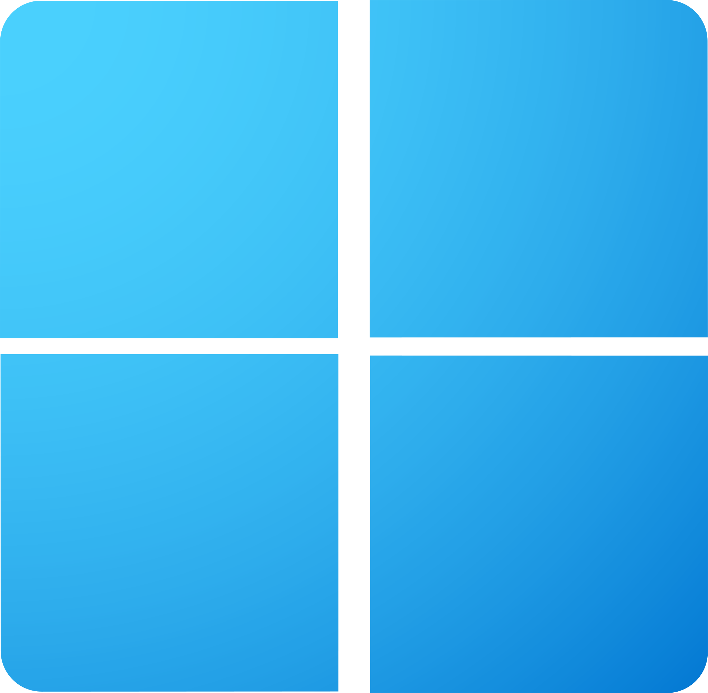

# ⚡ Windows Debloat & Gaming Optimization Tool

A powerful and customizable PowerShell script designed to **debloat**, **optimize**, and **tweak Windows** for **maximum performance**, reduced latency, and an enhanced **gaming experience**.

> Is currently in development.

<a href="README.ptbr.md">Switch to Portuguese (PT-BR)</a>

---

## 🚀 Key Features

- **System Cleanup**
  - Clears temporary files
  - Performs disk cleanup using native utilities

- **App Removal**
  - Uninstalls unnecessary built-in apps
  - Removes OneDrive, Edge, and other preinstalled bloatware

- **Network Optimization**
  - Tweaks TCP/IP stack for lower latency
  - Sets fast and reliable DNS servers

- **Performance Tweaks**
  - Enables the **Ultimate Performance** power plan
  - Disables hibernation and unnecessary scheduled tasks
  - Disables visual effects for better responsiveness

- **System Tweaks**
  - Applies registry and service-level optimizations
  - Disables telemetry, data collection, and unnecessary background services

- **Feature Disabling**
  - Disables legacy and unused features: Internet Explorer, Hyper-V, Media Player, etc.

- **Input Latency Improvements**
  - Enables SOCD (Simultaneous Opposite Cardinal Direction)
  - Disables high-latency system components

- **System Restore Point**
  - Automatically creates a restore point before making changes

---

## 🧠 Recommended Device Manager Tweaks

To further reduce latency and improve gaming performance, disable the following devices via **Device Manager**:

- AMD Controller Emulation
- AMD Crash Defender
- Composite Bus Enumerator
- High Precision Event Timer (HPET)
- Microsoft Hyper-V Virtualization Infrastructure Driver
- Microsoft Virtual Drive Enumerator
- NDIS Virtual Network Adapter Enumerator
- Remote Desktop Device Redirector Bus
- System Speaker

---

## 🛠️ How to Use

1. **Download**  
   Clone or download this repository to your local machine.

2. **Run as Administrator**  
   Right-click `debloat.ps1` and select **"Run as administrator"**.

3. **Reboot Required**  
   Restart your system to fully apply all changes.

---

## ✅ Best Practices

- ⚠️ **Backup your system** before running any system-level scripts.
- 🎮 Check and install the latest GPU, chipset, and network drivers after optimization.
- 🧩 Customize scripts like `registry.ps1` or `services.ps1` to match your specific needs.

---

## 📌 Notes

- Some features and apps will be **permanently removed or disabled**.
- This script is **performance-focused**: ideal for **gaming rigs**, low-latency setups, and power users.
- Use responsibly and review each section if you're unsure.

---

## 📄 License

This project is open-source and provided under the [MIT License](LICENSE).  
**Use at your own risk.**

---

💬 Found a bug or have a suggestion? [Open an issue](https://github.com/JonathanFerraz/debloat-windows/issues)

---

© 2025 R Y Z Ξ N Optimizer.

